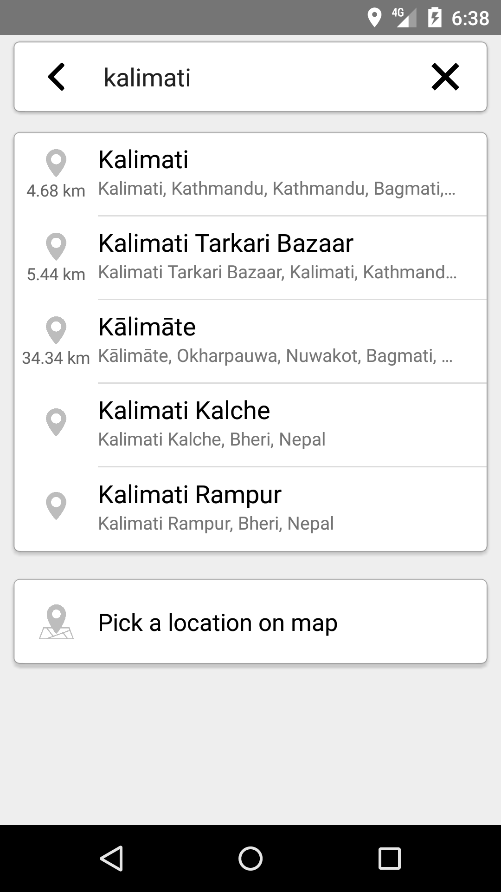
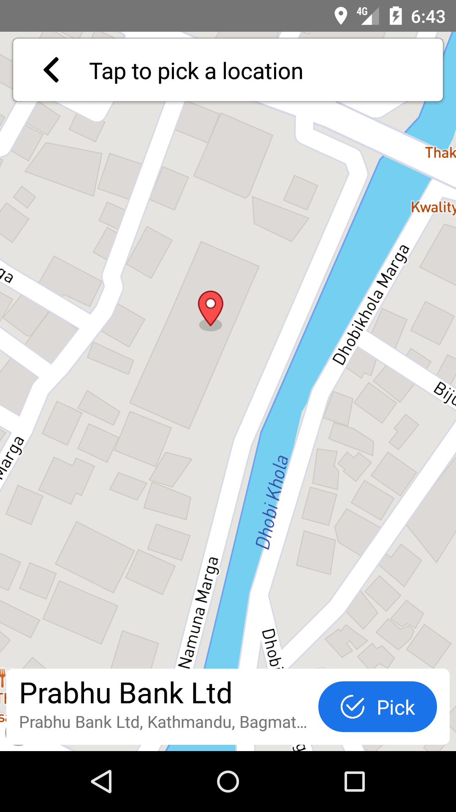
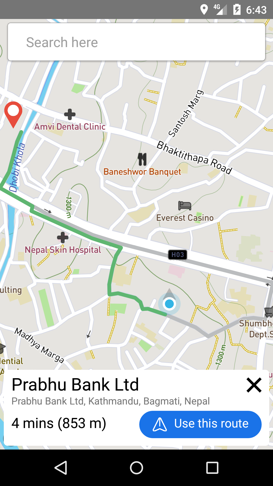
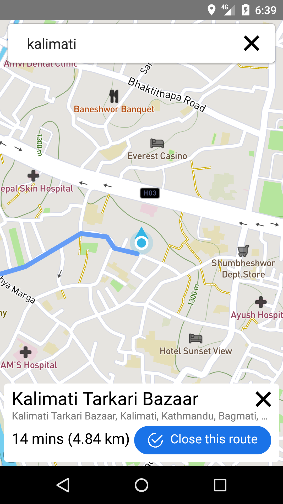
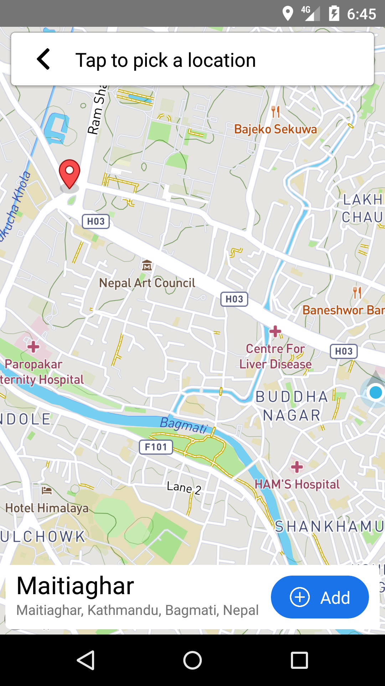
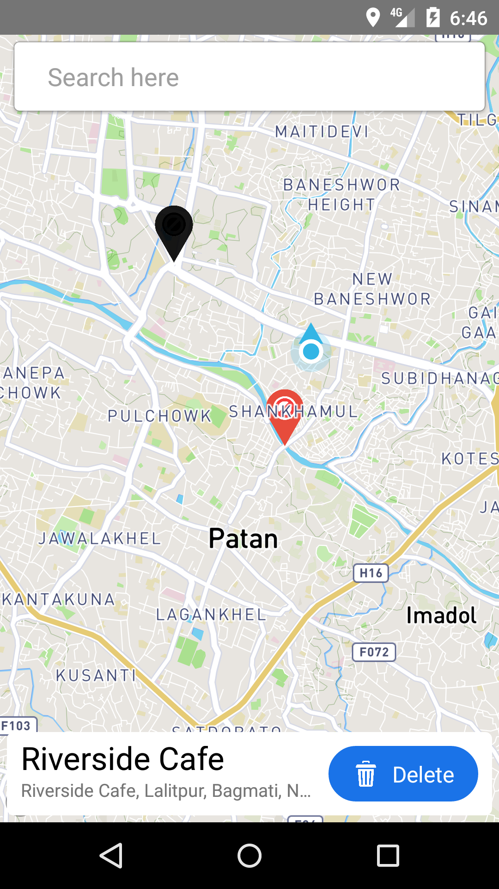

# LifeLine-App-Test

Testing codes for LifeLine app (MAJOR PROJECT)

## Screenshots

| Search destination                                             | Pick destination                                             |
| -------------------------------------------------------------- | ------------------------------------------------------------ |
|  |  |

| Pick route to destination                                             | Route to destination                                             |
| --------------------------------------------------------------------- | ---------------------------------------------------------------- |
|  |  |

| Add Obstruction                                             | Delete Obstruction                                             |
| ----------------------------------------------------------- | -------------------------------------------------------------- |
|  |  |

## Branch

- **react-navigation-4.x**
  - Code to navigate between screens using [React Navigation _v4.x_](https://reactnavigation.org/)
  - For comparing with navigation using **react-native-router-flux**
  - Decided to use this
- **react-native-router-flux**
  - Code to navigate between screens using [React Native Router Flux _v4.x_](https://github.com/aksonov/react-native-router-flux)
- **envVar**
  - Trying to read the data stored in _.env_ file using _process.env_. **FAILED**
- **react-native-dotenv**
  - Read data from _.env_ file using a module react-native-dotenv
  - Followed instructions this [link](https://levelup.gitconnected.com/how-to-gracefully-use-environment-variables-in-a-react-native-app-7f1600446116)
- **mapboxMap**
  - Codes for [Mapbox Map](https://github.com/react-native-mapbox-gl/maps)
- **searchLocation**
  - Search the for location using [Mapbox GL JS Geocoding API](https://docs.mapbox.com/mapbox-gl-js/example/mapbox-gl-geocoder/)
- **mapboxSDK**
  - Searching for locations using [Mapbox SDK JS](https://github.com/mapbox/mapbox-sdk-js)
  - Trace route from user current location to the selected destination
- **pickLocation**
  - Allowing the user to pick a location on Map and trace a route to that location
- **changeUI**
  - Making a more Google Maps app like UI
  - Adding small animation
- **addObstruction**
  - Add and remove obstruction marker on map

## Attribution

- _[add](src/assets/images/add.png)_ (edited) - Icons made by [dmitri13](https://www.flaticon.com/free-icon/add_992651?term=add&page=1&position=1) from [www.flaticon.com](https://www.flaticon.com/)
- _[addButton](src/assets/images/addButton.png)_ (edited) - Icons made by [Pixel perfect](https://icon54.com/) from [www.flaticon.com](https://www.flaticon.com/)
- _[back](src/assets/images/back.png)_ - Icons made by [Roundicons](https://www.flaticon.com/authors/roundicons) from [www.flaticon.com](https://www.flaticon.com/)
- _[cross](src/assets/images/cross.png)_ - Icons made by [Those Icons](https://www.flaticon.com/free-icon/close_2089733) from [www.flaticon.com](https://www.flaticon.com/)
- _[finish](src/assets/images/finish.png)_ (edited) - Icons made by [Kiranshastry](https://www.flaticon.com/authors/kiranshastry) from [www.flaticon.com](https://www.flaticon.com/)
- _[pickMap](src/assets/images/pickMap.png)_ (edited) - Icons made by [Good Ware](https://www.flaticon.com/authors/good-ware) from [www.flaticon.com](https://www.flaticon.com/)
- _[pin](src/assets/images/pin.png)_ (edited) - Icons made by [Freepik](https://www.flaticon.com/authors/freepik) from [www.flaticon.com](https://www.flaticon.com/)
- _[search](src/assets/images/search.png)_ - Icons made by [Freepik](https://www.flaticon.com/authors/freepik) from [www.flaticon.com](https://www.flaticon.com/)
- _[trash](src/assets/images/trash.png)_ (edited) - Icons made by [Freepik](https://www.flaticon.com/authors/freepik) from [www.flaticon.com](https://www.flaticon.com/)
- _[use](src/assets/images/use.png)_ (edited) - Icons made by [Freepik](https://www.flaticon.com/authors/freepik) from [www.flaticon.com](https://www.flaticon.com/)
- _marker_ (edited) used in [destinationMarker](src/assets/images/destinationMarker.png), [obstructionMarker](src/assets/images/obstructionMarker.png) and [pickedLocationMarker](src/assets/images/pickedLocationMarker.png) - Icons made by [Those Icons](https://www.flaticon.com/free-icon/pin_484167?term=pin&page=1&position=3) from [www.flaticon.com](https://www.flaticon.com/)
- _block_ (edited) used in [obstructionMarker](src/assets/images/obstructionMarker.png) - Icons made by [DinosoftLabs](https://www.flaticon.com/authors/dinosoftlabs) from [www.flaticon.com](https://www.flaticon.com/)
- _flag_ used in [destinationMarker](src/assets/images/destinationMarker.png)- Icons made by [Freepik](https://www.flaticon.com/authors/freepik) from [www.flaticon.com](https://www.flaticon.com/)

## Issues

Tested on **ANDROID** only

- **on Android 5.1.1**
  - MapboxGL.Camera.setCamera() doesn't always work
  - MapboxGL.Camera.fitBounds() zooms out every time it is called eventually causing error
  - MapboxGL.MapView.onPress() is not fired after ShowRouteInfo is rendered i.e. only it is only fired once

## License

This project is licensed under the Apache License 2.0 - see the [LICENSE](LICENSE) file for details.
